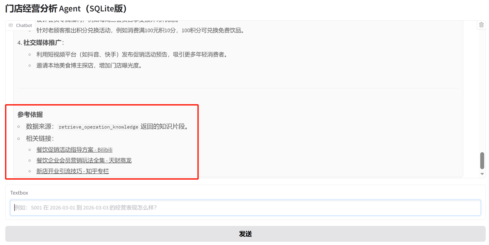

# 🏪 Store Analytics Agent

An LLM-powered business analytics agent for store performance diagnosis
Built with Qwen-Agent + Tool Calling (Function Calling)

## 📌 Overview

This project implements an intelligent Store Analytics Agent that enables users to:

Upload store operation data (CSV / Excel)
Ask business-related questions in natural language
Automatically receive structured insights and actionable recommendations

The system follows a LLM + Tool Calling architecture:

LLM (Qwen) → understands intent, selects tools, generates insights
Tools (Python) → perform deterministic data analysis

👉 This enables a full pipeline from natural language → data → decision insights

---

## 🎯 Goals

### 🛠️ Roadmap

#### ✅ V1.1 (Short-term)
 Add analyze_sales_trend tool
 Improve anomaly detection
V1 Objectives (2026年4月7日16:28:47）
User Workflow
User uploads store data, User asks a business question (e.g. performance, decline reasons)

Agent: Understands the problem, Selects the appropriate analysis tool, Executes data analysis, Generates structured diagnosis and recommendations

🔹 analyze_store_sales

Purpose: Analyze store performance over a given time range

| Parameter  | Type   | Description                |
| ---------- | ------ | -------------------------- |
| file_path  | string | Path to uploaded CSV/Excel |
| store_id   | string | Store ID (e.g. S001)       |
| start_date | string | Start date                 |
| end_date   | string | End date                   |

#### ✅ Hybrid Knowledge Retrieval (V1.5)

The agent now supports:

🔥 Structured Data Analysis

🔥 Local Knowledge Base (RAG)

🔥 Web Search (Tavily API)

👉 This enables:

```code
Data → Diagnosis → Knowledge → External Trends → Final Decision
```
#### 🔜 V2.0 (Product-level)
 Data visualization (charts)
 Auto-generated reports (PDF)
 Multi-agent architecture
 RAG (business knowledge integration)
💡 Key Design Principle

❗ LLM does NOT calculate data — it calls tools

Tools → deterministic computation
LLM → reasoning + explanation

👉 Ensures accuracy + controllability

---

## Example Questions
Why is S001 revenue declining?
Analyze S001 performance from 2026-03-01 to 2026-03-03

## 🧠 Architecture
```code
User Input
   ↓
LLM (Qwen)
   ↓
Tool Selection (Function Calling)
   ↓
├── analyze_store_sales       (Data Tool)
├── retrieve_operation_knowledge
│     ├── Local RAG
│     └── Web Search (Tavily)   ← NEW
   ↓
Structured Results
   ↓
LLM generates diagnosis & recommendations
```

## 🚀 Getting Started
1️⃣ Create Environment
```bash
conda create -n agent python=3.10
conda activate agent
```
2️⃣ Install Dependencies
```bash
pip install -U openai requests python-dotenv
pip install pandas gradio qwen-agent openpyxl
pip install sentence-transformers faiss-cpu numpy
pip install tavily-python
```
3️⃣ Configure Environment Variables

Create a .env file in the project root:
```code
DASHSCOPE_API_KEY=your_api_key
DASHSCOPE_BASE_URL=https://dashscope.aliyuncs.com/compatible-mode/v1
```
⚠️ Notes:

Do NOT hardcode API keys in code
The system uses python-dotenv to load environment variables
Ensure .env is in the project root
4️⃣ Run the Application
```bash
python app.py
```
Open in browser:

http://localhost:7860

## 📁 Project Structure (Main files)
```bash
store_agent/
├── app.py
├── knowledge_base/ #local knowledge base
├── tools/
│   ├── store_tools.py
│   └── rag_tools.py        # Hybrid retrieval (RAG + Web)
├── rag/
│   └── retriever.py        # Vector search
│   └── build_index.py        # run to generate files under rag
├── data/
│   └── store_sales.db
├── workspace_logs/
├── .env
└── README.md
```



